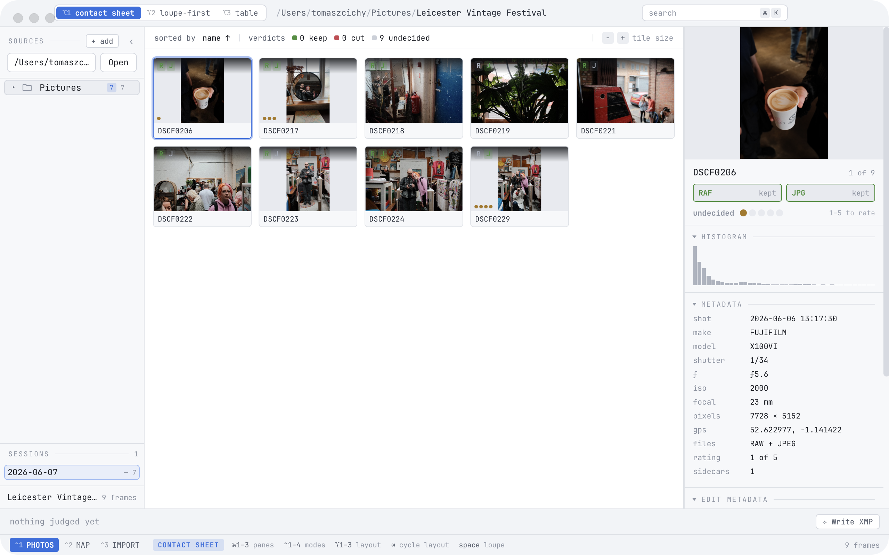
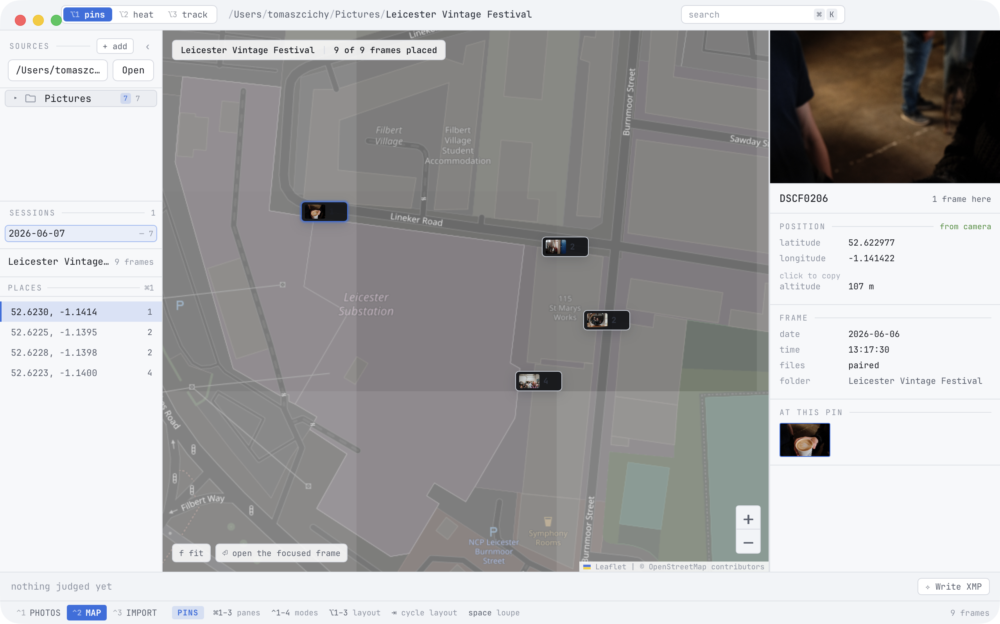

<p align="center">
  <picture>
    <source media="(prefers-color-scheme: dark)" srcset="assets/brand/wordmark.svg">
    
  </picture>
</p>

<p align="center">
  A keyboard-driven desktop app for culling RAW+JPEG shoots — decide, per frame, what survives:
  both files, the JPEG only, the RAW only, or neither.
</p>

<p align="center">
  <a href="https://github.com/tomaszcichy9825/culler/actions/workflows/ci.yml"></a>
  <a href="https://github.com/tomaszcichy9825/culler/releases/latest"></a>
  <a href="LICENSE"></a>
</p>

<p align="center">
  
</p>

## Why

Existing open-source cullers treat the RAW as the primary asset and de-duplicate the JPEG away. If you shoot RAW+JPEG where the JPEG is a first-class deliverable — Fujifilm film simulations, in-camera profiles, straight-out-of-camera delivery — that is backwards.

culler is built around a **per-frame three-way decision** over a RAW+JPEG pair, with the JPEG as the thing you actually look at when it exists.

Non-goals, still: no develop/edit module, no AI culling, no telemetry, no plugin system.

## What it does

- **Cull with two keys and a mask.** `k` keep, `x` cut; `r` and `j` scope the verdict to the RAW or JPEG half. `1`–`5` for star ratings. `Enter` shows the plan, then applies it.
- **Three views of the grid** — contact sheet, loupe-first, and a sortable table — plus a 1:1 loupe, side-by-side compare, and histograms.
- **A library that stays out of the way.** Add folders as roots and they are indexed into a local catalogue: full-text search (`/`), facet filters, sessions, and a folder tree. The catalogue lives in the app's own data directory — never beside your photographs.
- **Ingest from cards** with routing templates (`{date:2006}/{camera}`), a second verified copy to a backup destination, and a promise the app keeps: the card is left exactly as it was found.
- **A map.** Frames with GPS cluster on a map; frames without can be geotagged by dropping a pin or copying a position from another frame — written into JPEGs in place and to XMP sidecars for RAWs.
- **Metadata editing in the inspector.** Capture time, artist, copyright, strip-GPS — drafted per frame or across a selection, written with `⌘S` through the same plan/backup/undo pipeline as everything else. XMP export for ratings and labels.
- **Everything on the keyboard.** `⌘K` command palette, `f` filters, `m`/`c` move and copy palettes, `?` shows the keymap. Every binding is remappable in settings.

<p align="center">
  
</p>

## Safety

This is code that deletes people's photographs, so:

- **Deletion is never permanent by default.** Rejects go to the OS trash (Finder Trash, Recycle Bin, XDG trash) or to a `_Rejected/` subfolder. The only real destruction is an explicit "empty rejects" command that shows a full count breakdown first.
- **Every applied batch is journaled** to an append-only log with per-action outcomes; undo replays it backwards — files, and the decisions that moved them.
- **Nothing is ever written to the card**: no cache, no database, no sidecars. Removable and read-only media are detected and refused for writes.
- Collisions on copy/move never silently overwrite, and verified copies are byte-checked before a source is removed.

## Keys

| Key | Action |
|---|---|
| `k` / `x` | keep / cut the frame |
| `r` / `j` | scope the verdict to the RAW / JPEG half |
| `1`–`5`, `0` | star rating / clear |
| `Space` | loupe · `z` 1:1 zoom · `⇧C` compare |
| `Tab` | cycle the mode's layouts |
| `s`, `⌘A` | select, select all |
| `Enter` | apply — the plan is shown first |
| `⌘Z` | undo the last batch |
| `/` | search the library · `f` filters |
| `m` / `c` | move / copy to a destination |
| `⌘S` | write drafted metadata |
| `⌘K` | command palette · `?` the whole keymap |
| `⌃1` `⌃2` `⌃3` | PHOTOS · MAP · IMPORT |

## Formats

**RAW**: RAF, ARW, CR2, CR3, NEF, NRW, ORF, RW2, DNG, PEF, SRW, RWL, 3FR, IIQ, X3F and more. Previews come from the full-size JPEG embedded in the RAW, so RAW-only folders work without a demosaicer.

**JPEG-class**: JPG, HEIC, HEIF, PNG, TIFF, WebP, AVIF.

The extension lists are config-driven, so unknown formats can be added without a new release. Unrecognised files are ignored, never touched.

## Install

Grab the latest [release](https://github.com/tomaszcichy9825/culler/releases): a macOS DMG (Apple Silicon), a Windows installer, or a Linux AppImage/deb. One binary, no runtime dependencies.

> macOS builds are not yet notarised: right-click → Open on first launch.

### Build from source

Go 1.23+ and Node 22:

```sh
make tools    # installs the wails3 CLI
make package  # builds the app for the host platform
```

## Status

Usable and dogfooded daily, moving fast. The design lives in [docs/DESIGN.md](docs/DESIGN.md); changes land through PRs with CI on macOS, Windows and Linux. Project board: [github.com/users/tomaszcichy9825/projects/5](https://github.com/users/tomaszcichy9825/projects/5/views/1).

## Support

culler is free and MIT-licensed, with no paywalled features. If it saves you time on the review after a shoot, you can [sponsor its development](https://github.com/sponsors/tomaszcichy9825).

## Licence

[MIT](LICENSE)
